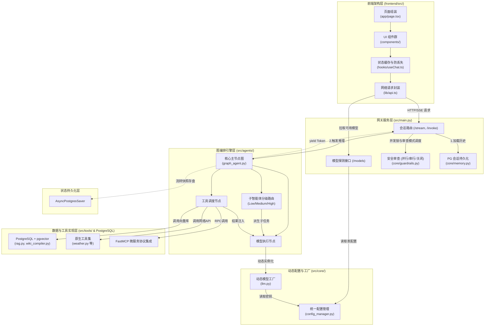
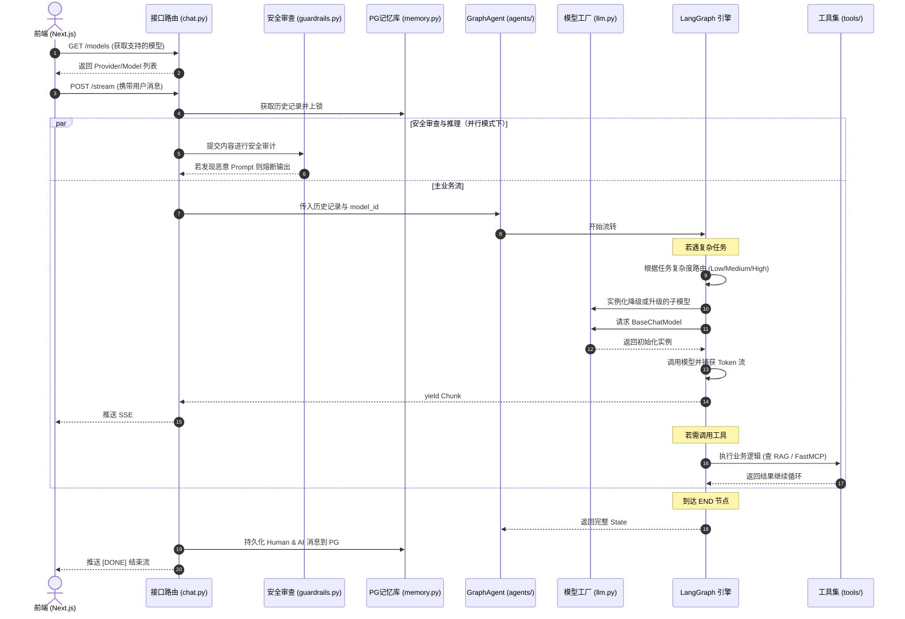

# AgentOps Core

AgentOps Core 是一个基于 LangGraph 和 FastAPI 构建的智能体（AI Agent）基础服务平台，构建了一个具备多智能体协同、外部工具调用 (FastMCP)、动态模型调度与安全审查的“混合云原生”大模型基座。

## 核心特性 (Key Features)

- **多智能体编排 (Multi-Agent & Subagent Tiering)**：单主节点（Main Agent）统筹请求，所有工具直连；面临复杂推理需求时，动态创建带有独立上下文的子智能体。支持根据任务复杂度（简单/中等/复杂）自动路由至配置的不同层级模型（Low/Medium/High），实现算力成本的最佳分配。
- **多模式安全审查 (Security Review Modes)**：
  - **串行执行 (Sequential)**：拦截器安全完成后触发主模型流，规避单并发 API 限制。
  - **并行执行 (Parallel)**：双通道并发，一旦截获恶意 Prompt Injection 即刻熔断主模型流式输出。
  - **关闭 (Off)**：直接调用主模型，不经过安全拦截。
- **统一数据持久化 (Unified PostgreSQL Persistence)**：借助 PostgreSQL 实现全链路存储。
  - **会话管理**：所有基于 `thread_id` 的聊天历史及线程元数据完全存储于 PostgreSQL，支持前端重命名与删除。
  - **动态配置**：大模型 API、路由规则及前台呈现开关等环境变量均存储于 PostgreSQL 并实现热重载。
  - **快照追踪**：通过 `AsyncPostgresSaver` 实现 LangGraph 节点检查点状态持久化。
- **可靠的基础设施**：借助 `asyncio.Lock` 与后端状态同步解决 `thread_id` 并发竞争问题；前端引入本地缓存与 SSR Hydration 修复页面刷新导致的会话丢失。
- **工具链协议化 (FastMCP)**：通过 `langchain-mcp-adapters` 将内部工具解耦为独立的 Model Context Protocol 微服务节点。
- **混合知识库 (Knowledge Base)**：基于 pgvector 存储向量，融合传统的切块 RAG 和基于大模型编译提炼的结构化 Wiki 检索引擎。

## 全局代码框架图




## 核心流转时序图

描述一次用户发起对话后，经过安全审查和子智能体调度的完整生命周期。



## 快速启动 (Getting Started)

### 1. 服务端准备 (Backend)

后端采用 `uv` 进行依赖管理，需确保环境中已配置 PostgreSQL (含 pgvector 扩展) 及 Redis 实例：

```bash
# 安装依赖
uv sync

# 启动 FastAPI 服务
uv run uvicorn main:app --app-dir src --host 0.0.0.0 --port 8080 --reload
```
*(默认运行于 http://localhost:8080)*

### 2. 客户端准备 (Frontend)

```bash
cd frontend
npm install
npm run dev
```
*(聊天界面：http://localhost:3000 | 管理页面：http://localhost:3000/admin)*

## 许可证

MIT License
