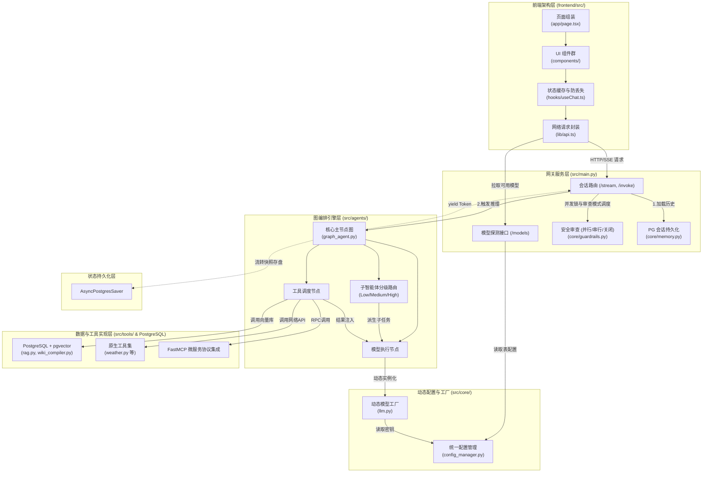
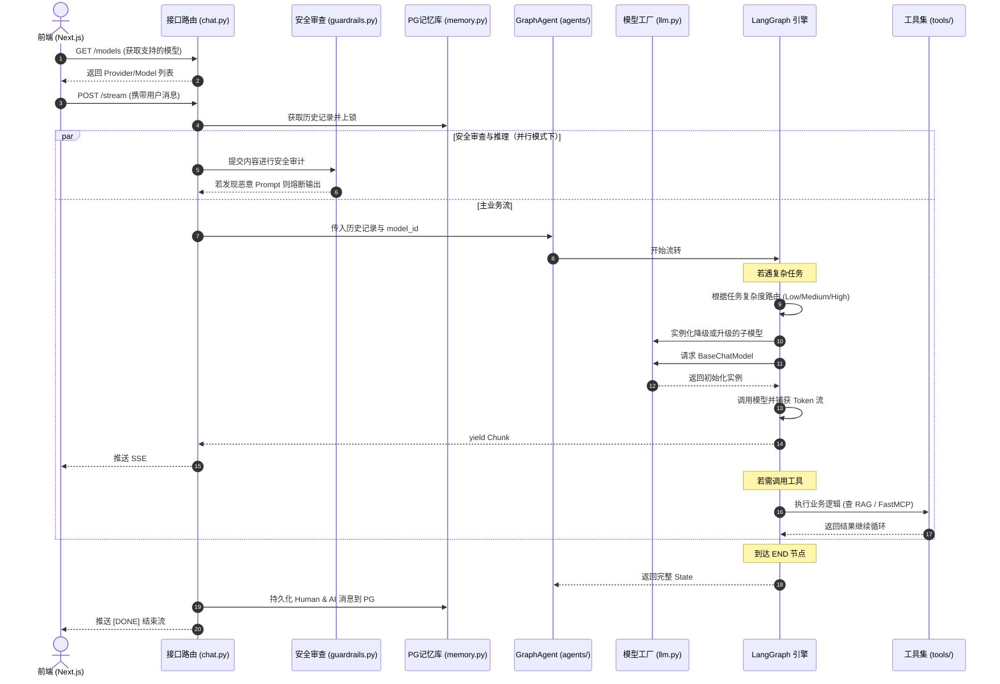

# AgentOps 平台：整体架构与运行机制总览

本项目是一个基于 Docker 容器化的 AgentOps 服务平台，构建了一个具备多智能体协同、外部工具调用 (FastMCP)、动态模型调度与安全审查的“混合云原生”大模型基座。

## 系统特性 (Key Features)

- **多智能体编排 (Multi-Agent & Subagent Tiering)**：单主节点（Main Agent）统筹请求，面临复杂需求时动态创建带有独立上下文的子智能体。支持根据任务复杂度（简单/中等/复杂）自动路由至（Low/Medium/High）三个层级的模型，实现算力成本的最佳分配。
- **多模式安全审查 (Security Review Modes)**：
  - **串行 (Sequential)**：拦截器安全完成后触发主模型流，规避单并发限制。
  - **并行 (Parallel)**：双通道并发，截获恶意 Prompt 即刻熔断主模型流式输出。
  - **关闭 (Off)**：直接调用主模型。
- **统一数据持久化 (Unified PostgreSQL Persistence)**：借助 PostgreSQL 实现全链路存储，包括会话管理（`messages`, `threads` 表）、大模型动态配置（API 密钥与路由规则）、LangGraph 状态快照（`AsyncPostgresSaver`）。
- **可靠的基础设施**：借助 `asyncio.Lock` 与后端状态同步解决 `thread_id` 并发竞争问题；前端引入本地缓存与 SSR Hydration 修复会话丢失。
- **混合知识库 (Knowledge Base)**：基于 pgvector 存储向量，融合传统的切块 RAG 和基于大模型编译提炼的结构化 Wiki 检索引擎。

---

## 全局代码框架图

当前系统架构不仅整合了前端交互，还在后端实现了清晰的分层，以下节点均与真实的源码文件强对应。

---

## 核心流转时序图

该时序图详细描述了一次用户发起对话后，经过安全审查和子智能体调度的完整生命周期。

---

## 编码规范提示

- **模型动态解析**：模型 ID 使用 `{provider}/{model_name}` 结构（例如 `openai/gpt-4o`）。在 `src/core/llm.py` 内动态切分，不再依赖固化的 Enum。
- **子智能体开发**：在 `graph_agent.py` 中，如果需要开发新的专门子智能体，必须通过 `invoke_subagent` 统一入口，按 `complexity` 申请算力，不要直接硬编码模型名。
- **并发与持久化**：所有的存储操作均需通过 `src/core/memory.py` 的 PostgreSQL 连接池完成。禁止使用本地 JSON 或 SQLite 保存核心业务数据。
- **工具开发**：新增加的系统工具应统一放置于 `src/tools/` 下，完善异常捕获后返回给大模型。
